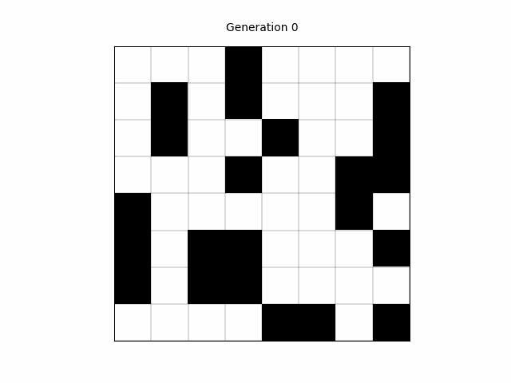

# Distributed Game of Life using MPI

A high-performance parallel implementation of a slight variation of Conway’s Game of Life using MPI. Includes both sequential and parallel versions (Send/Recv and Collectives), along with a standalone visualization notebook.

## Rule Variation

This version uses a modified neighborhood for each cell. Instead of the 8 immediate neighbors, each cell looks at a custom pattern:

- `(i-2, j-2)`
- `(i-1, j)`
- `(i-1, j+1)`
- `(i, j-2)`
- `(i, j+1)`
- `(i+2, j-2)`
- `(i+2, j)`
- `(i+2, j+2)`

The rules are:
- A cell becomes or stays alive if it has exactly 3 neighbors.
- A cell stays alive if it has exactly 2 neighbors and is already alive.
- Otherwise, the cell becomes or remains dead.

The grid wraps around (toroidal).

## Compilation

To compile the program, run:

```sh
make
```

To clean up the compiled binaries and object files, run:

```sh
make clean
```

## Running the Program

### Sequential Run

To run the sequential program, use the following command:

```sh
./main_sequential -n <grid_size> -s <seed> -d <density> -i <iterations> [-v]
```

Example:

```sh
./main_sequential -n 8 -s 2 -d 20 -i 10
```

### Parallel Run

To run the parallel program, use the following command:

```sh
mpirun -np <number_of_processes> ./main_{sendrecv,collectives} -n <grid_size> -s <seed> -d <density> -i <iterations> -r <repetitions> [-v] [-c]
```

Example:

```sh
mpirun -np 4 ./main_sendrecv -n 8 -s 2 -d 20 -i 10 -r 1
```

- `-np <number_of_processes>`: Number of processes
- `-n <grid_size>`: Size of the grid
- `-s <seed>`: Seed for random number generation
- `-d <density>`: Density percentage
- `-i <iterations>`: Number of iterations
- `-r <repetitions>`: Repetitions
- `-v`: Verbose mode (optional)
- `-c`: Verify results by comparing with the sequential run (optional)

## Output

### Sequential

```sh
./main_sequential -n 1024 -s 2 -d 20 -i 10 -r 3
```

```raw
n       seed    density iters   implementation  time (ms)       alive   dead
1024    2       20      10      sequential      45.190777       282689  765887
1024    2       20      10      sequential      44.530085       282689  765887
1024    2       20      10      sequential      47.758312       282689  765887
```

### Parallel SendRecv

```sh
mpirun -np 4 ./main_sendrecv -n 1024 -s 2 -d 20 -i 10 -r 3
```

```raw
np      n       seed    density iters   dimx    dimy    implementation  time (ms)       alive   dead
4       1024    2       20      10      2       2       sendrecv        10.266107       282689  765887
4       1024    2       20      10      2       2       sendrecv        14.951359       282689  765887
4       1024    2       20      10      2       2       sendrecv        13.364727       282689  765887
```

### Parallel Collectives

```sh
mpirun -np 4 ./main_collectives -n 1024 -s 2 -d 20 -i 10 -r 3
```

```raw
np      n       seed    density iters   dimx    dimy    implementation  time (ms)       alive   dead
4       1024    2       20      10      2       2       collectives     10.252547       282689  765887
4       1024    2       20      10      2       2       collectives     10.510888       282689  765887
4       1024    2       20      10      2       2       collectives     10.843257       282689  765887
```

## Visualization Notebook

The `animate.ipynb` notebook provides a visual animation of the Game of Life using NumPy and Matplotlib. It simulates and displays cell evolution across generations based on an initial state.

